

  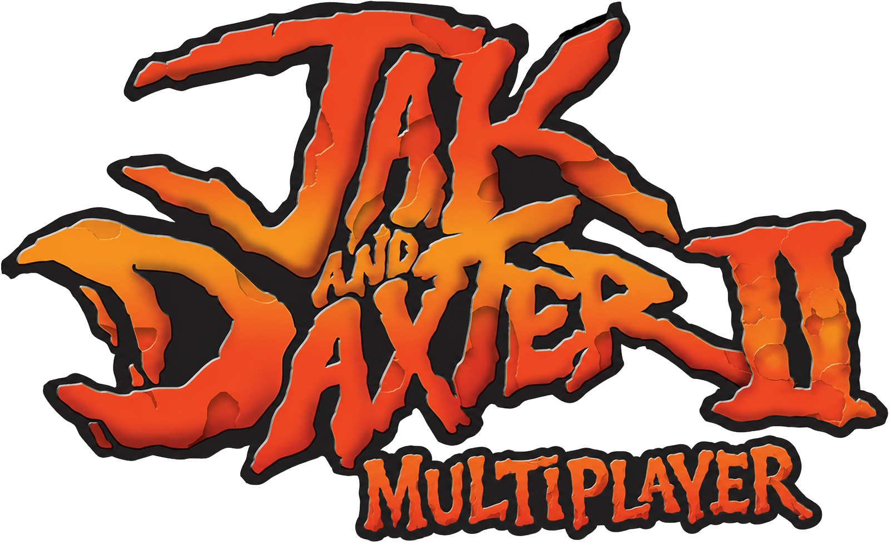

# Jak and Daxter II Multiplayer

A Jak II multiplayer mod for OpenGOAL. One player hosts as Jak, the other joins as Daxter, and the game syncs player movement, vehicles, enemies, traffic, missions, cutscenes, and (most of) the world state as you play.

## Current State

This is a very early MVP multiplayer build, so expect a ton of bugs, unstability and crashes. Currently only Act I (up until the palace Baron bossfight) is playable, the game will lock further progress after you've completed that mission.
However, the goal is to make the full Jak II campaign playable together. 
Currently this mod only serves as a 2 player Co-op mod, but most likely will be extended to support more players and gamemodes.

## Before You Play

- Both players should use the same version of the mod.
- For online play, the host may need to allow the game through Windows Firewall, and also manually port-forward.
- The default game port is `26210`.

LAN discovery is available through **Find LAN**, but direct connect is the most reliable option when playing over the internet.

## Hosting A Game

1. Start the mod.
2. Choose **Host Game** from the title menu.

   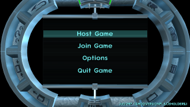

3. Choose **New Game** or **Load Game**.

   

   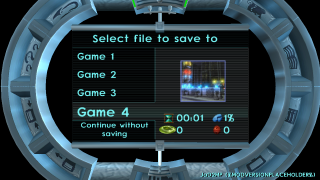

4. Wait on the host screen until the Daxter player connects.

   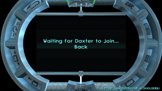

5. Once the client connects, the game will continue into the selected save or new game.

   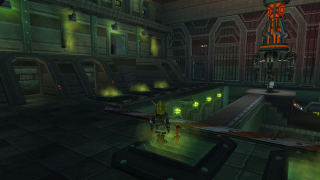

The host is Jak. In general, if something important needs to be decided by the game world, let the host trigger it.

## Joining A Game

1. Start the mod.
2. Choose **Join Game** from the title menu.

   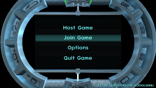

3. If you are on the same network as the host, try **Find LAN**.

   

4. If the game is not found, choose **Direct Connect**.

   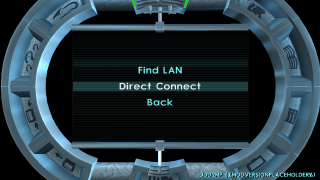

5. Enter the host's IP address and port.

6. Use port `26210` unless the host tells you otherwise.

   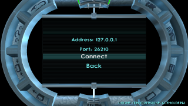

The joining player is Daxter.

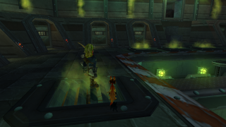

## Entering The IP Address

You will need a keyboard to type the IP address. You can still select the **Address** and **Port** fields with a controller by pressing **X** on the field. If you are using the keyboard already, press **Space** instead.

Once the field is selected, type the host's IP address or port. When you are done, press **X** or **Space** again to stop editing that field.

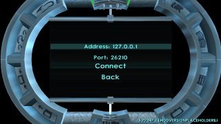

If the IP address is invalid, it will show in red.

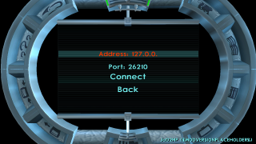

## Local Split Screen

You can play locally by running two instances of the game in windowed mode and placing them next to each other. Have one instance choose **Host Game**, then have the other choose **Join Game** and **Find LAN**.

Each instance should recognize a connected controller. If you only have one controller, use the controller for one game window and the keyboard for the other.

## Playing Together

- If you notice a lot of unstability then it's probably best if you let the host lead the missions, enter major transitions, and drive important story progress.
- If something looks wrong on the client, the fastest fix is usually to reconnect as the client.
- If the host leaves, the session is over. Start hosting again and have the client reconnect.
- There have been some major adjustments to the vanilla game to make it work with multiple targets in mind.
- Have fun!

## Quick Fixes

### Anything looks desynced or very much broken on the Client side?

The Reconnect button is going to act as your primary safeline while playing this mod I fear, so don't be afraid to use it!

  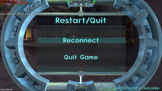

### The Client Cannot Find The Host

Check Windows Firewall on the host machine and allow the game/OpenGOAL through it. For internet play, the host may also need to forward UDP port `26210` on their router.

## Known Rough Edges

- The remote player puppets can miss their animation triggers, so when they jump they might be "falling" until their legs hit the floor.
- The Traffic Sync is very much so host owned, if the client player exits the host's traffic radius the handover is pretty invasive, it's going to remove all traffic on the client's side until he gets far enough from the Host. When he does the Client is going to start spawning peds and vehicles locally.
- Reconnecting is currently the main recovery path for client-side issues and soft-locks.
- Some situations may still behave better when the host leads the interaction.
- Testing has not been very thorough, so please feel free to report any issues or game-breaking bugs you find!

## Credits

Built on [OG-Mod-Base](https://github.com/OpenGOAL-Mods/OG-Mod-Base) and of course the amazing [OpenGOAL and the Jak II PC port](https://github.com/open-goal) work done by the OpenGOAL community.
