

  

# Jak and Daxter II Multiplayer

A Jak II multiplayer mod for OpenGOAL. 
Can be played Online or LAN and even in "faked" split-screen. 
Supports up to 8 players at the moment. The mod is capable of supporting more, it just hasn't been seriously tested with more so far, the limit can be overriden in a developmental build. 
The intentional experience is tailored around 2 players where one plays as Jak, the other as Daxter (why Daxter got back his name in the mod title), but should be able to progress through the story with even 8 players, the experience will be just even more funkier

## Current State

This is a very early MVP multiplayer build, so expect a ton of bugs, unstability and crashes. Currently only Act I (up until the palace Baron bossfight) is playable, the game will lock further progress after you've completed that mission. 
The goal is to make the full Jak II campaign playable together. 
Currently this mod primarily serves as a Co-op mod, when the Campaign is in a finished state, more gamemodes are going to be supported as well. 
If at least the Host is in debug mode then a lot of constraints I've put in to block progression can be bypassed.

## Terminology

### Invite

- **IMPORTANT**: The invite will contain your public IP address, so be careful who you're sharing it with.
- An **Invite** is a **URI** you can easily copy and share with your friends, whom if they have it on their clipboard, can just click a button to join your session.
- It can only be obtained as the Host, and only if your port is successfully opened. The **Invite** contains your public IP address and the Port you're hosting on, and also the session **Room Code**, which is automatically generated if it's not set in the **Multiplayer Options**
- Example: `jad2mp://1.1.1.1:26210/1A2B3C`

### Room Code
- A six character code that can contain uppercase letters (`A-Z`) and digits (`0-9`), which is used as your session's "password". It is only used as a protection for Online Sessions, it's not needed for LAN.
- Example: `1A2B3C`

## Before You Play

- The mod was mainly tested with the NTSC-U (`SCUS-97265`) version of the game. If you notice bugs please record what version you were using.
- Make sure to align with what each version of the mod all players have installed. You cannot join a session that is running on a different version of the mod. You can see the mod version in-game in the bottom right corner.
- When you Host you'll get a prompt to allow `gk` through the firewall, if you want to Host Online, you'll need to give it access.
- The mod has **UPnP (Universal Plug and Play)** support, which means that if your router supports it, and you're not behind a CGNAT for example, then the game will attempt to do an automatic port mapping on your router, so you don't have to manually port forward. This is temporary, and after your host session ends, the mapping is removed. This feature can be turned off in the **Multiplayer Settings** in game.
- UPnP is not expected to work for everyone especially nowadays, so if you can't port-forward I'd suggest to use some private VPN solution like Hamachi, Radmin, Tailscale etc...
- The default game port is `26210` which can be configured in the **Multiplayer Settings**
- Port `26211` is reserved for LAN discovery

### Good to know

#### Changing your in-game name
- To change your name you have to go into **Options** -> **Multiplayer Options**
- Press  to select the **Username** field, and using your keyboard you're free to type in a maximum of 16 characters as your name.

#### Changing your appearance
- You can edit the color your name and map marker will appear in under **Options** -> **Multiplayer Options** -> **Edit Appearance**  or in the **Lobby** by pressing 
- You're also free to customize the colors of your Jak or Daxter avatar

#### Custom keybinds
- **SELECT** - While in game you can press it to show the player list, and also the nametags above each player.
- L1 + 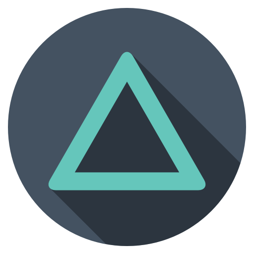 - While near an empty vehicle will get you into it's passenger seat.

## Hosting A Game

### Choose **Host Game** from the **Main Menu**

   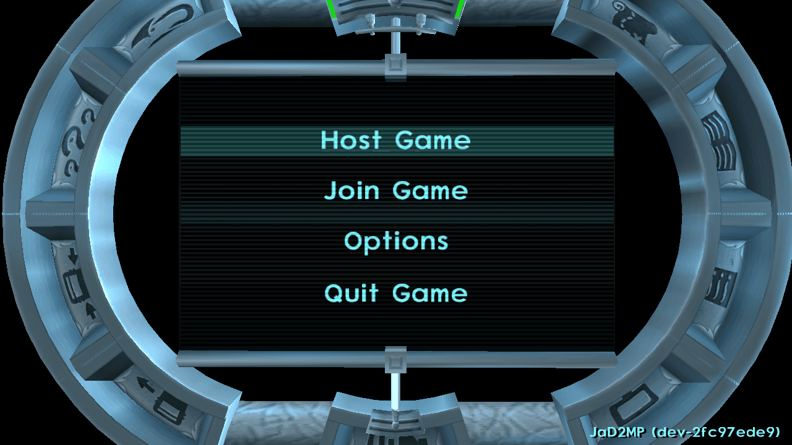

### Choose **Host LAN** or **Host Online**

   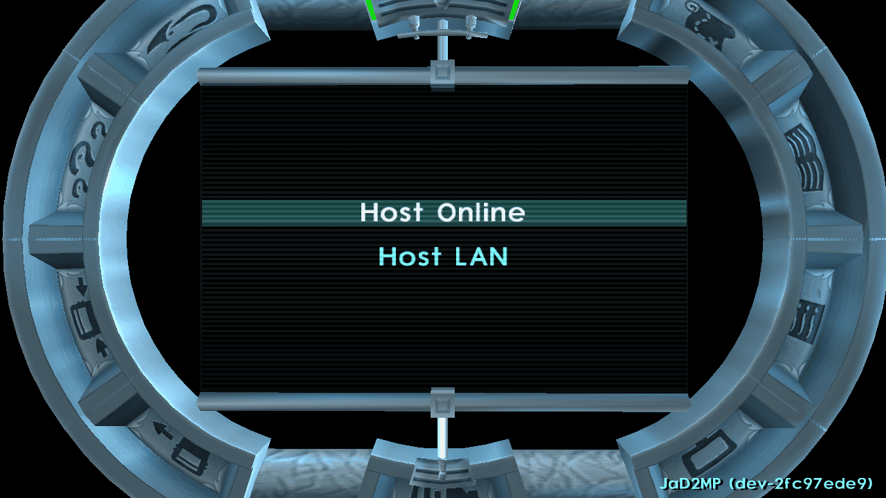

### Choose **New Game** or **Load Game**

   

   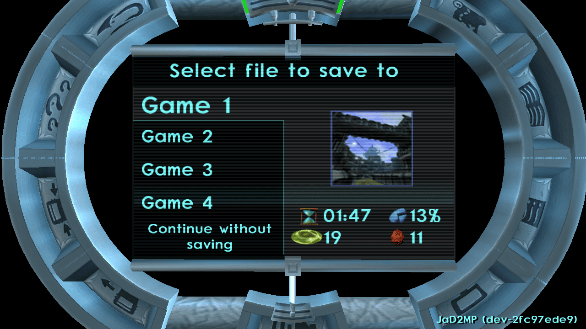

### Inside the **Lobby** as the **Host**

   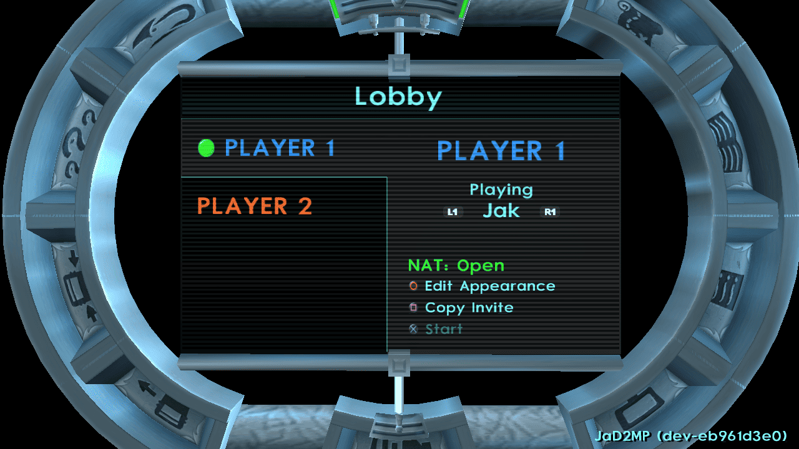
   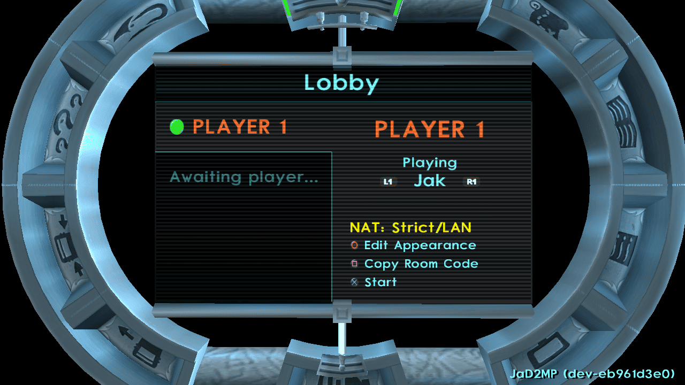
   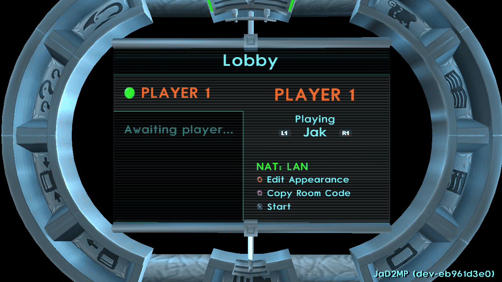

  - In the **Lobby** you can wait for the other players to join, or just start the game, since the mod supports late joiners mid game also. 
  - As **Host** you also have the ability to Swap between playing **Jak** or **Daxter** with **R1** and **L1** 
  - If you have your game port successful opened then you can press  to copy an invite which will contain your public ip and port, with your custom or generated **Room Code**. You can share this to your friends who then can use it to join easily.
  - If the port isn't open and you see **NAT: Strict/LAN** or you Hosted **LAN** and see **NAT: LAN** then you can only copy a **Room Code** which is not required in case you want to play via **LAN**
  - The game can only be started after each player has readied up

### Once you press  everyone in the lobby be will put inside the game

   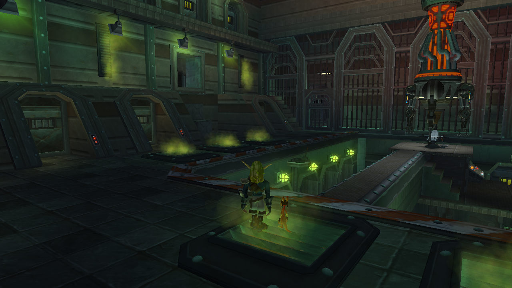

  - In general it's a good practice to let the Host lead the important game progression

## Joining A Game

### Choose **Join Game** from the title menu.

   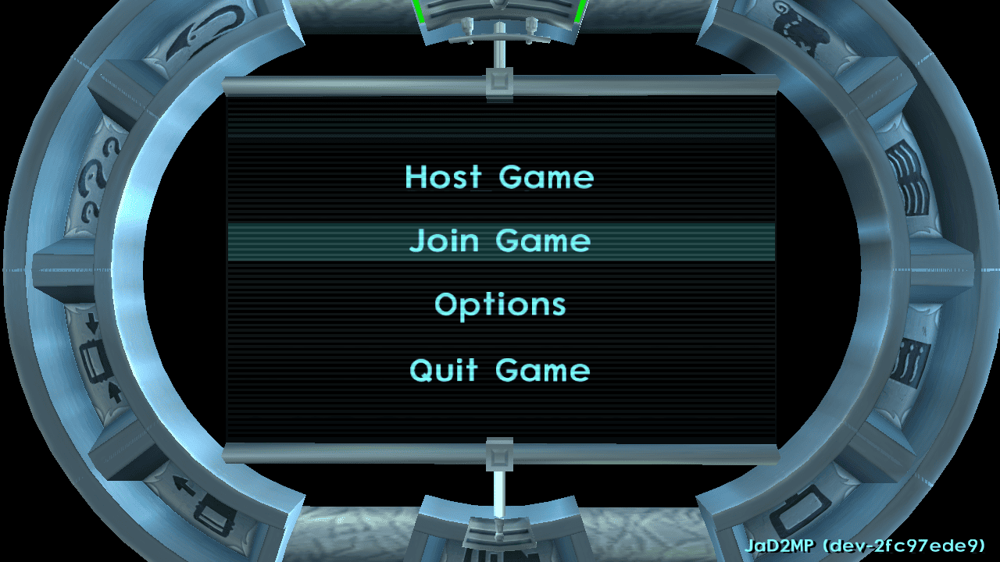

### Select one of the three joining methods:

### Option 1: **Join with Invite**

- Use this option when joining a friend over the internet using a copied host **Invite**

1. Copy the **Invite** sent by the host to your clipboard
2. Choose **Join with Invite**.
3. Select **Paste Invite**. The invite is going to be validated, and if its valid then the **Connect** button will light up
4. Select **Connect**.

   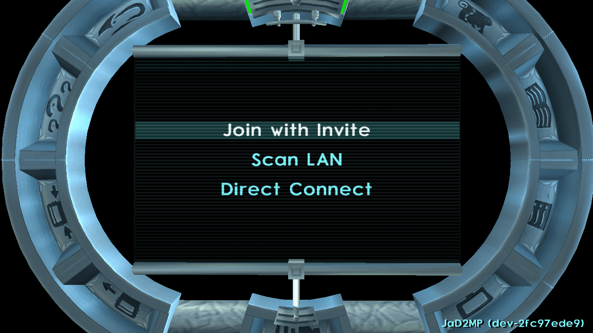
   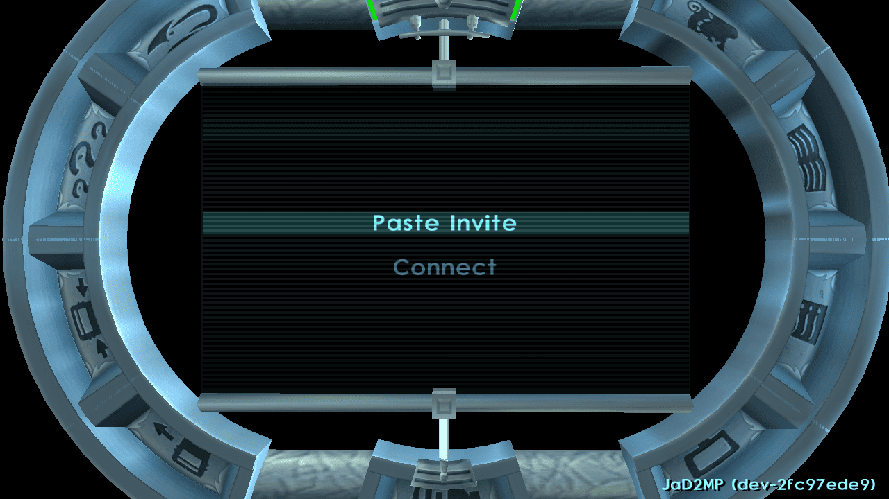

### Option 2: Scan LAN

- Use this option when playing on the same local network (LAN), through a local VPN solution like Radmin or Hamachi or just want to play split-screen

1. Choose **Scan LAN**.
2. The game will search for active hosts on your private network and connect automatically.

### Option 3: Direct Connect

- Use this option if you manually want to specify the host details. (CTRL+V pasting works in the fields, just make sure to enter them first)

1. Choose **Direct Connect**.
2. Verify or update the target **Address**, **Port** (default `26210`), and optional **Room Code**.
3. Select **Connect**.

### Inside the **Lobby** as a **Client**

   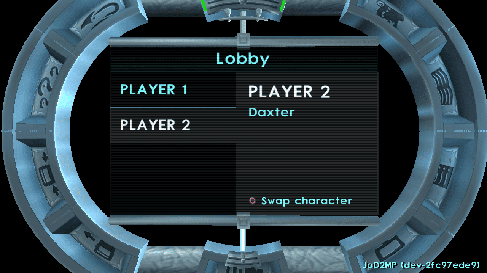

- As the Client you also have the ability to switch the Character you want to play as by pressing **L1** or **R1**
- You can edit your appearance in the lobby by pressing  also
- These options are disabled if you've readied up, if you change your mind you must unready first

## Local Split Screen

You can play locally by more instances of the game in windowed mode and placing them next to each other. Have one instance choose **Host Game**, then the others choose **Join Game** and **Scan LAN**.

Each instance should recognize a connected controller. If you only have one controller, use the controller for one game window and the keyboard for the other.

## Playing Together

- If you notice a lot of unstability then it's probably best if you let the host lead the missions, only the Host can progress through task nodes, the peers just sync up to them.
- If as a Client you're noticing a lot of unstability, or something completely broken, then your best bet is to just **Reconnect** ;)
- If the host leaves, the session is over. Start hosting again and have the Client(s) reconnect.
- There have been some major adjustments to the vanilla game to make it work with multiple targets in mind, so expect some missions to be somewhat altered.
- But the most importantly: **Have fun!**

## Quick Fixes

### Anything looks desynced or very much broken on the Client side?

The Reconnect button is going to act as your primary safeline while playing this mod I fear, so don't be afraid to use it!

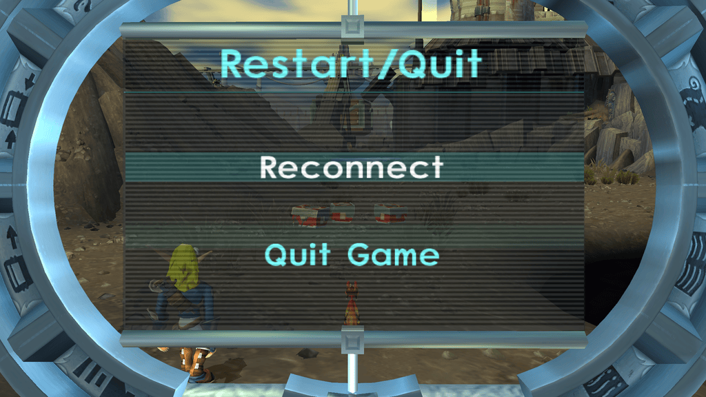

### The Client Cannot Find The Host

Especially when playing Online make sure to check the Firewall on the **Host**'s side and allow the game/OpenGOAL through it. 
If you're trying to connect through the Internet make sure that the Host has a little **NAT: Open** prompt shown in the lobby. 
If the Host has **NAT: Strict/LAN** or **NAT: Failed** then the Host is unable to serve the session through the internet, probably their port can't be forwarded, try a private VPN solution like Radmin, Hamachi etc.. 

## Known issues

- Random crashes are sadly still not unexpected, thankfully as the Host the game should be a bit more stable, as a Client it's pretty unproblematic to reconnect unless you're in a mission that has an NPC/Bot in it like Sig, since there's no catchup logic implemented for those type of missions (yet).
- The remote player puppets can miss their animation triggers, so when they jump they might be "falling" until their legs hit the floor.
- The Traffic Sync is very much so host owned, if the client player exits the host's traffic radius the handover is pretty invasive, it's going to remove all traffic on the client's side until he gets far enough from the Host. When he does the Client is going to start spawning peds and vehicles locally.
- Reconnecting is currently the main recovery path for client-side issues and soft-locks.
- Some situations may still behave better when the host leads the interaction.
- Testing has not been very thorough, so please feel free to report any issues or game-breaking bugs you find!
- The red and yellow gungames are pretty buggy, and are only roughly synced.

## Credits

Built on [OG-Mod-Base](https://github.com/OpenGOAL-Mods/OG-Mod-Base) and of course the amazing [OpenGOAL and the Jak II PC port](https://github.com/open-goal) work done by the OpenGOAL community.
