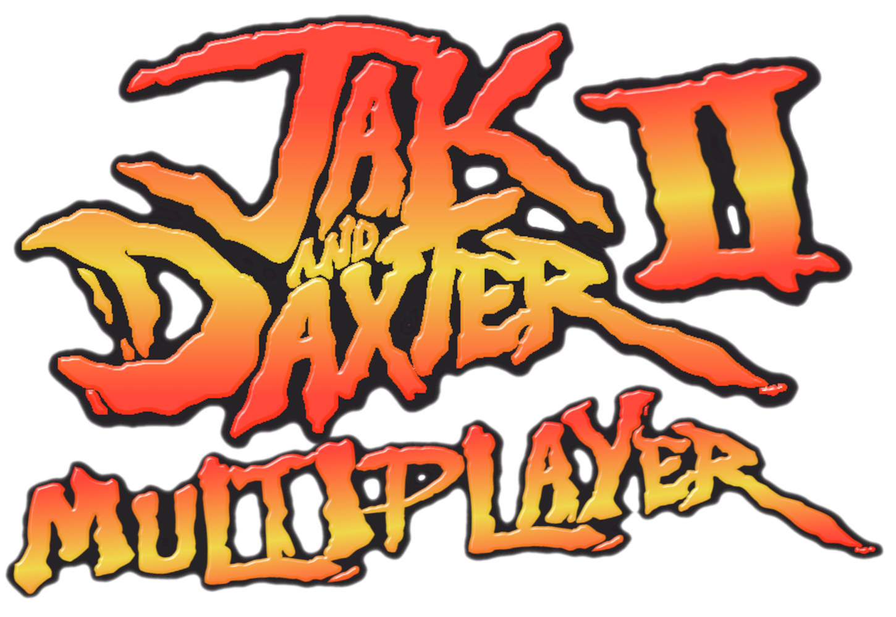
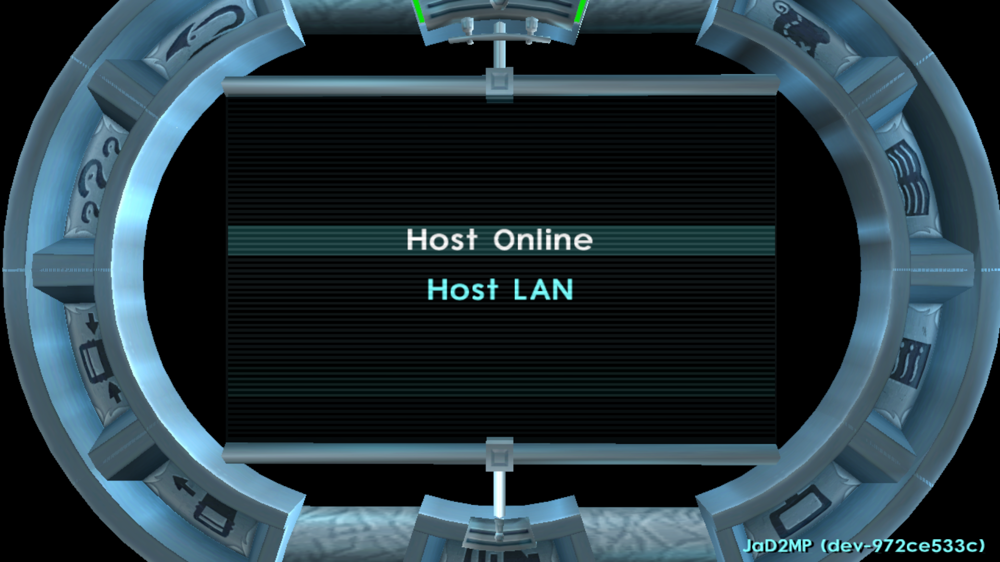
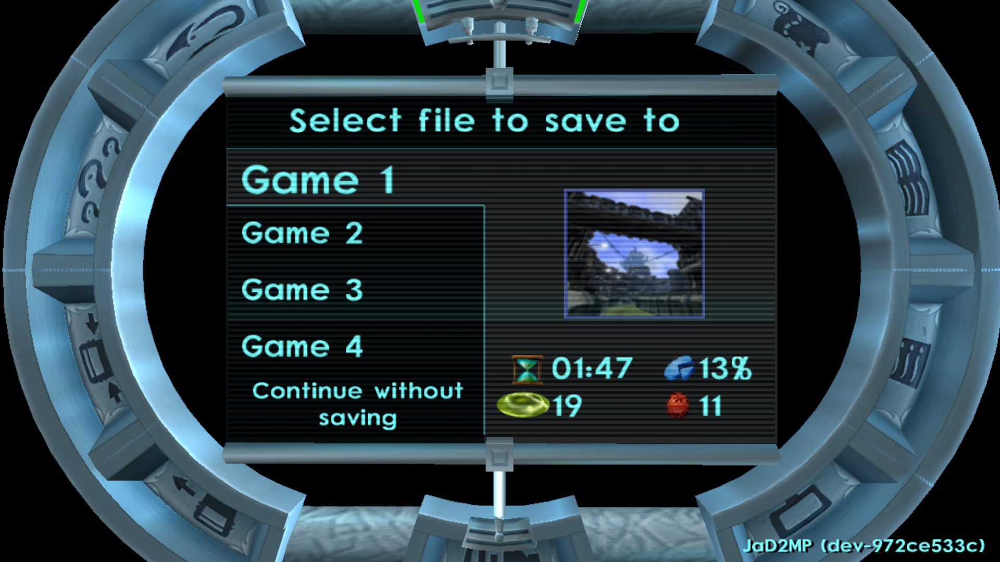
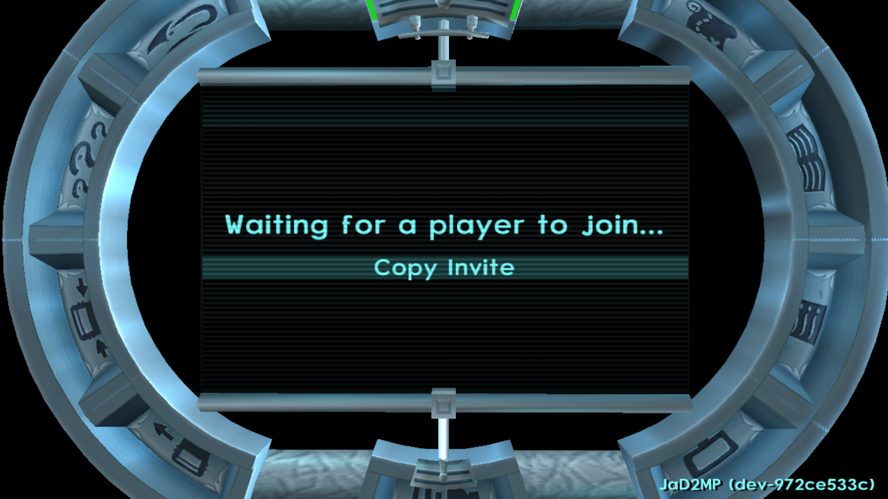
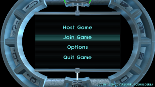
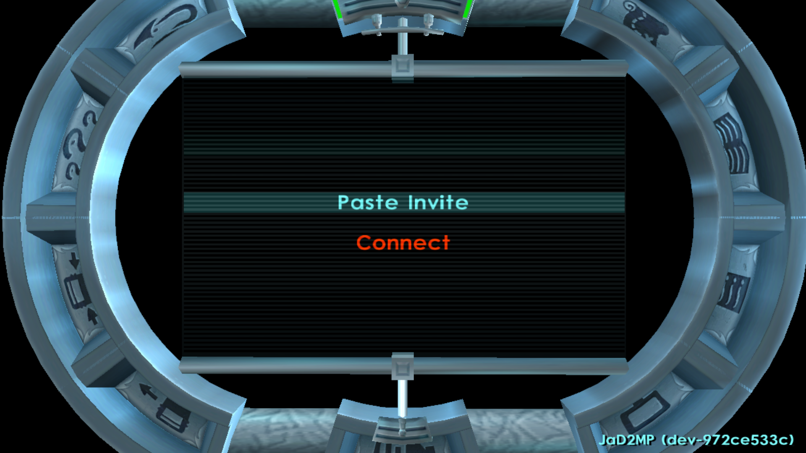
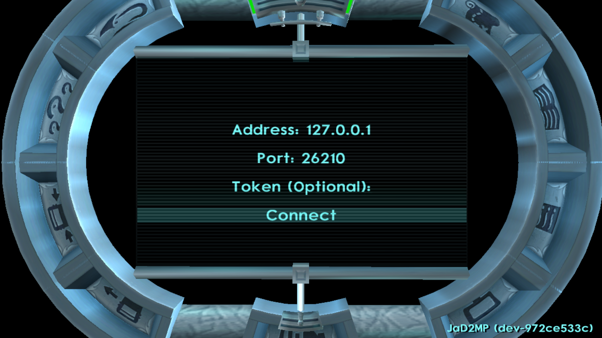
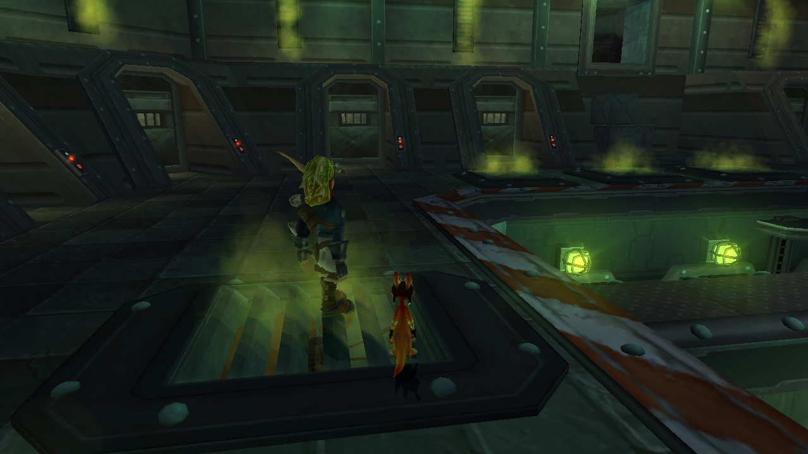
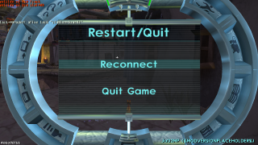

  

# Jak and Daxter II Multiplayer

A Jak II multiplayer mod for OpenGOAL. One player hosts as Jak, the other joins as Daxter, and the game syncs player movement, vehicles, enemies, traffic, missions, cutscenes, and (most of) the world state as you play.

## Current State

This is a very early MVP multiplayer build, so expect a ton of bugs, unstability and crashes. Currently only Act I (up until the palace Baron bossfight) is playable, the game will lock further progress after you've completed that mission.
However, the goal is to make the full Jak II campaign playable together. 
Currently this mod only serves as a 2 player Co-op mod, but most likely will be extended to support more players and gamemodes.

## Before You Play

- Both players should use the same version of the mod.
- For online play, the host may need to allow the game through Windows Firewall, and also manually port-forward.
- The default game port is `26210`.

## Hosting A Game

1. Start the mod.
2. Choose **Host Game** from the title menu.

   

3. Choose **Host LAN** or **Host Online**

   

4. Choose **New Game** or **Load Game**.

   

   

5. Select **Copy Invite**, then send the copied invite (will contain your public IP) privately to the other player. Wait on
   the host screen until they connect.

   

6. Once the client connects, the game will continue into the selected save or new game.

   

The host is Jak. In general, if something important needs to be decided by the game world, let the host trigger it.

## Joining A Game

1. Start the mod.
2. Choose **Join Game** from the title menu.

   

3. Select one of the three joining methods:

### Option 1: With Invite Token (Recommended for Online)
Use this option when joining a friend over the internet using a copied host invite string.

1. Copy the invite string sent by the host to your clipboard.
2. Choose **With Invite Token**.
3. Select **Paste Invite**. Once valid clipboard data is detected, the status will display **Paste Invite: Invite ready**.
4. Select **Connect**.

   
   

### Option 2: Scan LAN
Use this option when playing on the same local network (LAN) or local split-screen setup.

1. Choose **Scan LAN**.
2. The game will search for active hosts on your private network and connect automatically.

### Option 3: Direct Connect
Use this option to manually specify host details. (CTRL+V pasting is supported)

1. Choose **Direct Connect**.
2. Verify or update the target **Address**, **Port** (default `26210`), and optional **Token**.
3. Select **Connect**.

   

---

Once connected, the joining player enters the world as **Daxter**!

## Using An Invite

Online invites use form: `address:port/token` Do not post an invite publicly as it contains the host's public IP address! It is a
temporary credential for the current hosting session.

## Local Split Screen

You can play locally by running two instances of the game in windowed mode and placing them next to each other. Have one instance choose **Host Game**, then have the other choose **Join Game** and **Scan LAN**.

Each instance should recognize a connected controller. If you only have one controller, use the controller for one game window and the keyboard for the other.

## Playing Together

- If you notice a lot of unstability then it's probably best if you let the host lead the missions, enter major transitions, and drive important story progress.
- If something looks wrong on the client, the fastest fix is usually to reconnect as the client.
- If the host leaves, the session is over. Start hosting again and have the client reconnect.
- There have been some major adjustments to the vanilla game to make it work with multiple targets in mind.
- Have fun!

## Quick Fixes

### Anything looks desynced or very much broken on the Client side?

The Reconnect button is going to act as your primary safeline while playing this mod I fear, so don't be afraid to use it!

  

### The Client Cannot Find The Host

Check Windows Firewall on the host machine and allow the game/OpenGOAL through it. For internet play, the host should also forward the UDP port `26210` on their router.

## Known issues

- The remote player puppets can miss their animation triggers, so when they jump they might be "falling" until their legs hit the floor.
- The Traffic Sync is very much so host owned, if the client player exits the host's traffic radius the handover is pretty invasive, it's going to remove all traffic on the client's side until he gets far enough from the Host. When he does the Client is going to start spawning peds and vehicles locally.
- Reconnecting is currently the main recovery path for client-side issues and soft-locks.
- Some situations may still behave better when the host leads the interaction.
- Testing has not been very thorough, so please feel free to report any issues or game-breaking bugs you find!

## Credits

Built on [OG-Mod-Base](https://github.com/OpenGOAL-Mods/OG-Mod-Base) and of course the amazing [OpenGOAL and the Jak II PC port](https://github.com/open-goal) work done by the OpenGOAL community.
